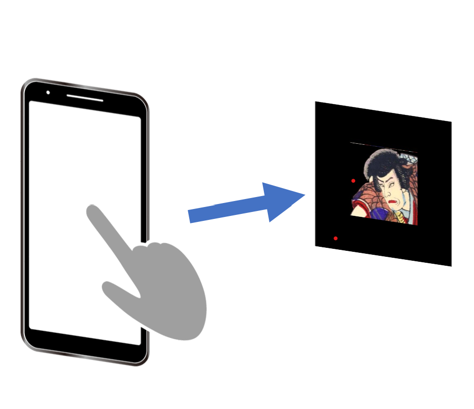
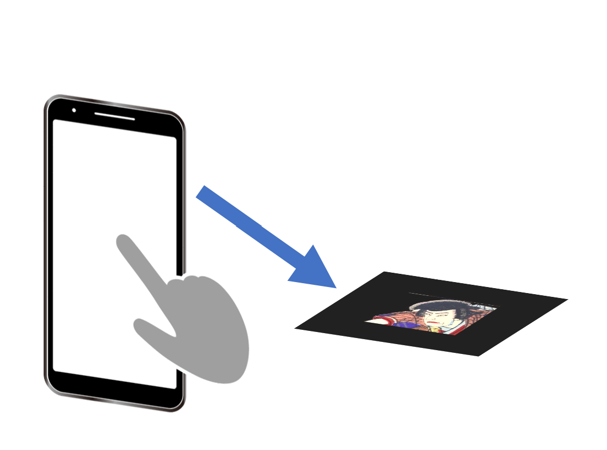

<h1> マーカーとカメラの位置関係を選んでください </h1>

<button style="width:40%;" type="button" onclick="location.href='https://tuckersarge.github.io/KabukuAR/'"> 
<h3> 正面</h3>
    
</button>
<button style="width:40%;" type="button" onclick="location.href='https://tuckersarge.github.io/KabukuARHorizontal/'">
<h3> 床面 </h3>
    
</button>

