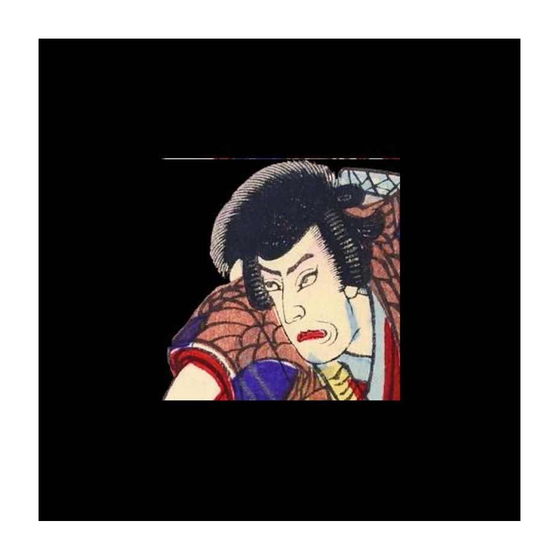

　本作品では、浮世絵の一種で、多色刷りの錦絵のおもちゃ絵から、組上げ灯籠（別称、関西では立版古・たてばんこ）を実際に組み立てて紹介いたします。
組上げ灯籠のおもちゃ絵は、娯楽作品を扱った絵草紙屋で、美人画や役者絵、風景画とともに売られました。
江戸後期の文化初年頃から大正まで約100年間、芝居や観光地、建物の仕組みを伝える紙工作として、組上げ灯籠は発展しました。
北斎が手掛けた湯屋の作品などもあります。

　今回は春の展示に加えてAR版も用意し、カメラ付のデバイスがあれば目の前で組上げ灯籠を楽しめるようにしました。

> ARデモ映像

<video muted controls style="width:100%;">
    <source src="kabukuDemo.mp4" type="video/mp4">
</video>

# AR版 組上げ灯籠の楽しみ方

以下２つをご用意下さい。
- カメラ付のデバイス（iPhone等のスマートフォンや、ウェブカメラ付のパソコン）
- ARマーカーを表示するもの（画像が表示できる電子機器、あるいは紙に印刷してもお楽しみ頂けます）

用意ができましたら、下のマーカーを表示して準備します。
このページをそのまま表示しても良いですし、
[こちら](https://drive.google.com/uc?export=download&id=1RswJ7JvyC6WwOdtyOegoZtTK9tR1vYfL)
のリンクからマーカー画像のダウンロードも出来ます。
## AR用マーカー

これで準備は完了です。

以下のリンクからAR版組上げ灯篭を起動し、カメラへのアクセスを許可してマーカーを映してください。

あなたの目の前に名舞台が蘇ります。

### ARアプリケーションへ移動
- [こちらのリンク](app.md)
にアクセスするか、下のQRコードを読み取ってください。

## カメラが起動しない場合

ブラウザまたはデバイス自体が、カメラへのアクセスを認めていない可能性があります。
ブラウザやデバイスの設定を見直して下さい。

# あなたの体験を共有しよう！
＃kabukuAR とともに、ARに反応した写真をSNSに投稿してみてください。
あなたの日常が歌舞きはじめます。
皆さまの日常に現れた＃kabukuAR　は
[このリンク](https://twitter.com/search?q=%23kabukuAR&src=typed_query){:target="_blank"}
から確認出来ますので、他の方々の風景もどうぞお楽しみください。

<a href="https://twitter.com/intent/tweet?button_hashtag=kabukuAR&ref_src=twsrc%5Etfw" class="twitter-hashtag-button" data-show-count="false">Tweet #kabukuAR</a>

# 紙で制作した組上げ灯篭

春の展示では、実際に組上げ灯篭を紙で制作しました。
興味のある方は是非、下のリンクより暗闇に浮かび上がる名舞台をお楽しみ下さい。

[春の展示を見る（外部リンク）](https://sites.google.com/view/kabuku/){:target="_blank"}

ーーーーーーーーーーー  
紙で組上げ灯籠を作りたくなった方は…  
[「立命館大学アート・リサーチセンターのARC所蔵・寄託品 浮世絵データベース」検索結果](https://www.dh-jac.net/db/nishikie/results.php?f3=arcUP5617&f9=*&f11=1&-max=50&enter=portal)より
画像をダウンロードいただき、個人が楽しむ範囲内でお楽しみください。  
ーーーーーーーーーーー  
制作資料：「白浪五人男鎌倉極楽寺山門之場組上ケ」「五枚続」  
立命館大学アート・リサーチセンター所蔵（arcUP5617～acUP5621）  
画像切り抜き：東出りさ、鈴木嵩茂  
AR制作・サイト制作：鈴木嵩茂 髙橋初来
撮影：東出りさ  
制作協力：日比杏南  

###### This page is maintained by[TuckerSarge](https://github.com/TuckerSarge).